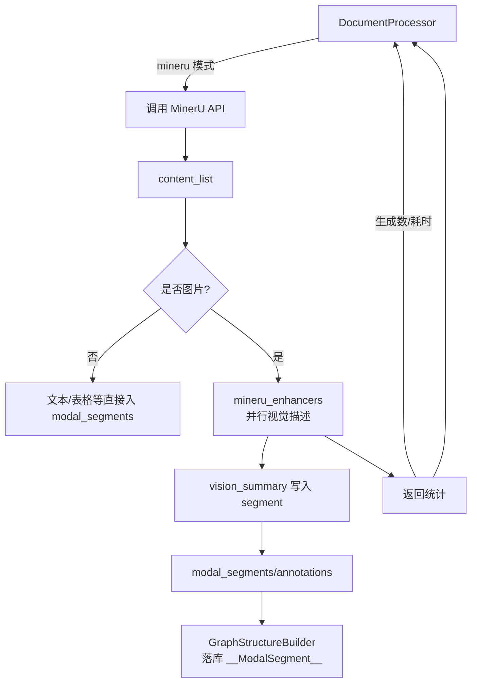

# 文档处理器模块

## 项目结构
```
graphrag_agent/
├── config/                     # 配置文件目录
│   └── settings.py             # 全局配置参数
└── pipelines/
    └── ingestion/              # 文档摄取处理模块
        ├── __init__.py         # 包初始化文件
        ├── document_processor.py  # 文档处理器核心类
        ├── file_reader.py      # 多格式文件读取器
        └── text_chunker.py     # 中文文本分块器
```

## 模块简介

文档处理器(Document Processor)负责读取、解析并分块各种格式的文档，同时在 MinerU 模式下提取多模态信息（图片、表格、公式等），为图谱构建与检索引擎提供结构化输入。

## 核心功能与实现思路

### 1. 文件读取 (FileReader)

`FileReader` 类提供了丰富的文件读取功能，支持多种常见文档格式：

- 文本文件 (TXT)
- PDF文档 (PDF)
- Markdown文档 (MD)
- Word文档 (DOCX, DOC)
- 数据文件 (CSV, JSON, YAML/YML)

读取器采用多种策略确保文件内容能够被正确读取：
- 支持多种编码格式，包括自动编码检测
- 对于旧版Word文档(.doc)采用多种备选读取方法
- 提供专用方法返回结构化数据（如CSV转为字典列表）

```python
# 使用示例
reader = FileReader(directory_path)
file_contents = reader.read_files(['.txt', '.pdf'])  # 指定读取的文件类型
```

### 2. 中文文本分块 (ChineseTextChunker)

`ChineseTextChunker` 类专门用于处理中文文本的分块需求，它能够：

- 使用HanLP进行准确的中文分词
- 根据语义界限（如句号、问号等）智能切分文本
- 支持块间重叠，保证上下文连贯性
- 处理异常情况和超长文本

```python
# 使用示例
chunker = ChineseTextChunker(chunk_size=500, overlap=100)
chunks = chunker.chunk_text(text_content)
```

### 3. 文档处理器 (DocumentProcessor)

`DocumentProcessor` 类整合文件读取和文本分块功能，提供完整的文档处理流程：

在传统 `legacy` 模式下，它只负责文本分块；在 `mineru` 模式下，则会调用 MinerU 服务进行多模态解析，并并行调用视觉模型生成图片描述，最终形成统一的结构化结果。

```python
# 使用示例
processor = DocumentProcessor(directory_path)
stats = processor.get_file_stats()  # 获取文件统计信息
results = processor.process_directory()  # 处理目录下所有支持的文件
```

在 MinerU 模式下，处理结果将包含以下关键字段，供图谱层和前端直接使用：

- `modal_segments`：带有 `segment_id`、`type`、`text`、`image_relative_path`、`table_html`、`latex` 等信息的多模态段落列表
- `chunk_annotations`：每个分块对应的段落引用信息，含 `segment_ids`、`segment_types`、`char_start`/`char_end`
- `image_assets`：所有抽取出的图片相对路径集合，可用于静态资源加载
- `mineru_task_id`、`mineru_output_dir`、`content_list_path`：MinerU 解析任务的回溯信息
- `image_vision_generated_count` / `image_vision_time`：本轮解析中新增的图片描述数量及耗时（秒），便于评估视觉模型开销

即便运行在 `legacy` 模式，以上字段也会以降级策略补齐（例如直接将分块视作文本段落），保证后续图谱构建流程的兼容性。

### 4. 并行视觉描述生成（mineru_enhancers）

自 `mineru_enhancers.py` 起，图片描述生成由 `ThreadPoolExecutor` 并行执行，可通过 `.env` 中的 `MINERU_VISION_MAX_WORKERS` 控制并发度；是否启用及提示词分别由 `MINERU_VISION_SUMMARY_ENABLE` 和 `MINERU_VISION_PROMPT_NAME` 决定。



构建图谱时，控制台会输出 “生成图片描述 X 条”/“补全缓存图片描述 X 条” 等提示，以便观察视觉处理进度。

## 核心函数

1. **`FileReader.read_files()`**: 根据指定的文件扩展名读取文件内容，返回文件名和内容的元组列表。

2. **`ChineseTextChunker.chunk_text()`**: 将单个文本智能分割成块，考虑语义边界和上下文重叠。

3. **`DocumentProcessor.process_directory()`**: 处理指定目录中的所有支持文件，返回包含文件信息、内容和分块结果的详细列表。

4. **`DocumentProcessor.get_file_stats()`**: 获取目录中文件的统计信息，包括文件类型分布、总内容长度和平均文件长度等。

## 使用场景

该模块适用于需要处理大量文档并进行后续语义分析的场景，如：

- 构建文档搜索系统
- 知识库问答应用
- 文档智能处理和归类
- 语料库建设与分析
