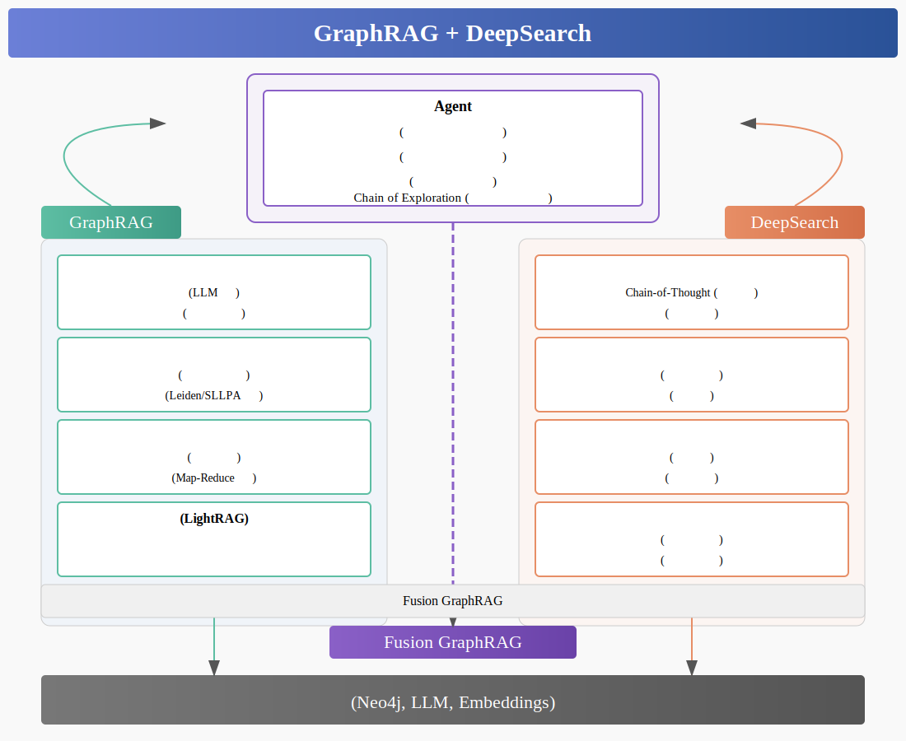
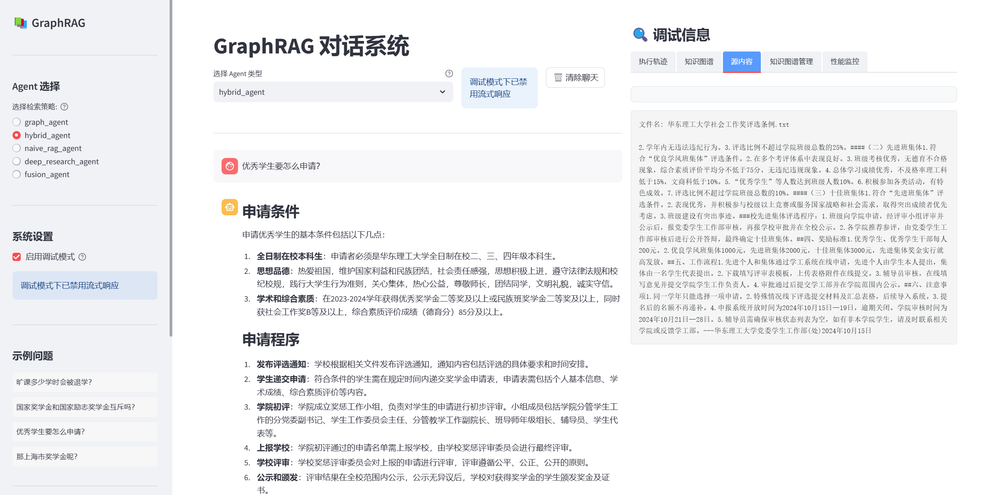
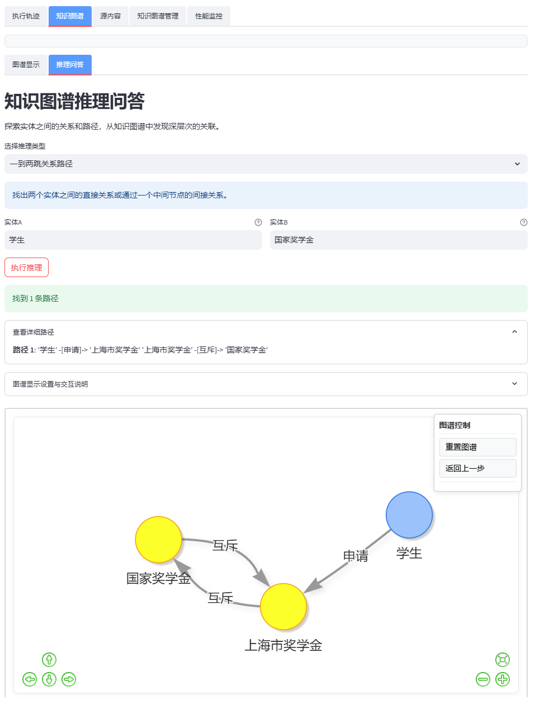

# GraphRAG + DeepSearch 实现与问答系统（Agent）构建

本项目聚焦于结合 **GraphRAG** 与 **私域 Deep Search** 的方式，实现可解释、可推理的智能问答系统，同时结合多 Agent 协作与知识图谱增强，构建完整的 RAG 智能交互解决方案。

> 💡 灵感来源于检索增强推理与深度搜索场景，探索 RAG 与 Agent 在未来应用中的结合路径。

## 🏠 项目架构图

**注：本项目已被[deepwiki](https://deepwiki.com/1517005260/graph-rag-agent)官方收录，有助于理解整体的项目代码和核心的工作原理**，另外还有类似的中文网址[zreadai](https://zread.ai/1517005260/graph-rag-agent/1-overview)

由Claude生成



## 📂 项目结构

```
graph-rag-agent/
├── graphrag_agent/         # 🎯 核心包 - GraphRAG智能体系统
│   ├── agents/             # 🤖 Agent模块 - 智能体实现
│   │   ├── base.py         # Agent基类
│   │   ├── graph_agent.py  # 基于图结构的Agent
│   │   ├── hybrid_agent.py # 混合搜索Agent
│   │   ├── naive_rag_agent.py # 简单向量检索Agent
│   │   ├── deep_research_agent.py # 深度研究Agent
│   │   ├── fusion_agent.py # Fusion GraphRAG Agent
│   │   └── multi_agent/    # Plan-Execute-Report 多智能体编排栈
│   │       ├── planner/    # 计划生成模块（澄清、任务分解、计划审校）
│   │       ├── executor/   # 执行协调模块（检索、研究、反思执行器）
│   │       ├── reporter/   # 报告生成模块（纲要、章节、一致性检查）
│   │       ├── core/       # 核心数据模型（PlanSpec、State、ExecutionRecord）
│   │       ├── tools/      # 工具组件（证据追踪、检索适配器）
│   │       └── integration/ # 集成层（工厂类、兼容门面）
│   ├── cache_manager/      # 📦 缓存管理模块
│   │   ├── manager.py      # 统一缓存管理器
│   │   ├── backends/       # 存储后端
│   │   ├── models/         # 数据模型
│   │   └── strategies/     # 缓存键生成策略
│   ├── community/          # 🔍 社区检测与摘要模块
│   │   ├── detector/       # 社区检测算法
│   │   └── summary/        # 社区摘要生成
│   ├── config/             # ⚙️ 配置模块
│   │   ├── neo4jdb.py      # 数据库连接管理
│   │   ├── prompt.py       # 提示模板
│   │   └── settings.py     # 全局配置
│   ├── evaluation/         # 📊 评估系统
│   │   ├── core/           # 评估核心组件
│   │   ├── metrics/        # 评估指标实现
│   │   └── test/           # 评估测试脚本
│   ├── graph/              # 📈 图谱构建模块
│   │   ├── core/           # 核心组件
│   │   ├── extraction/     # 实体关系提取
│   │   ├── indexing/       # 索引管理
│   │   └── processing/     # 实体处理
│   ├── integrations/       # 🔌 集成模块
│   │   └── build/          # 🏗️ 知识图谱构建
│   │       ├── main.py     # 构建入口
│   │       ├── build_graph.py # 基础图谱构建
│   │       ├── build_index_and_community.py # 索引和社区构建
│   │       ├── build_chunk_index.py # 文本块索引构建
│   │       ├── incremental/ # 增量更新子模块
│   │       └── incremental_update.py # 增量更新管理
│   ├── models/             # 🧩 模型管理
│   │   └── get_models.py   # 模型初始化
│   ├── pipelines/          # 🔄 数据管道
│   │   └── ingestion/      # 📄 文档摄取处理器
│   │       ├── document_processor.py # 文档处理核心
│   │       ├── file_reader.py # 多格式文件读取
│   │       └── text_chunker.py # 文本分块
│   └── search/             # 🔎 搜索模块
│       ├── local_search.py # 本地搜索
│       ├── global_search.py # 全局搜索
│       └── tool/           # 搜索工具集
│           ├── naive_search_tool.py # 简单搜索
│           ├── deep_research_tool.py # 深度研究工具
│           └── reasoning/  # 推理组件
├── server/                 # 🖧 后端服务（独立服务）
│   ├── main.py             # FastAPI应用入口
│   ├── models/             # 数据模型
│   ├── routers/            # API路由
│   └── services/           # 业务逻辑
├── frontend/               # 🖥️ 前端界面（独立服务）
│   ├── app.py              # 应用入口
│   ├── components/         # UI组件
│   └── utils/              # 前端工具
├── test/                  # 🧪 测试模块
│   ├── search_with_stream.py # 流式输出测试
│   └── search_without_stream.py # 标准输出测试
├── assets/                 # 🖼️ 静态资源
│   ├── deepsearch.svg      # RAG演进图
│   └── start.md            # 快速开始文档
└── files/                  # 📁 原始数据文件
```

**此外，每个模块下都有单独的readme来介绍模块的功能**


## 🚀 相关资源

- [大模型推理能力不断增强，RAG 和 Agent 何去何从](https://www.bilibili.com/video/BV1i6RNYpEwV)  
- [企业级知识图谱交互问答系统方案](https://www.bilibili.com/video/BV1U599YrE26)  
- [Jean - 用国产大模型 + LangChain + Neo4j 建图全过程](https://zhuanlan.zhihu.com/p/716089164)
- [GraphRAG vs DeepSearch？GraphRAG 提出者给你答案](https://mp.weixin.qq.com/s/FOT4pkEPHJR8xFvcVk1YFQ)


## ✨ 项目亮点

- **从零开始复现 GraphRAG**：完整实现了 GraphRAG 的核心功能，将知识表示为图结构
- **DeepSearch 与 GraphRAG 创新融合**：现有 DeepSearch 框架主要基于向量数据库，本项目创新性地将其与知识图谱结合
- **多 Agent 协同架构**：实现不同类型 Agent 的协同工作，提升复杂问题处理能力
- **完整评估系统**：提供 20+ 种评估指标，全方位衡量系统性能
- **增量更新机制**：支持知识图谱的动态增量构建与智能去重
- **实体质量提升**：实体消歧和对齐机制，有效解决实体歧义和重复问题
- **思考过程可视化**：展示 AI 的推理轨迹，提高可解释性和透明度

## 🏁 快速开始

请参考：[快速开始文档](./assets/start.md)

## 🧰 功能模块

### 图谱构建与管理

- **多格式文档处理**：支持 TXT、PDF、MD、DOCX、DOC、CSV、JSON、YAML/YML 等格式
- **LLM 驱动的实体关系提取**：利用大语言模型从文本中识别实体与关系
- **增量更新机制**：支持已有图谱上的动态更新，智能处理冲突
- **实体质量提升**：通过实体消歧和对齐提升实体准确性
  - **实体消歧（Entity Disambiguation）**：使用字符串召回、向量重排和NIL检测将mention映射到规范实体
  - **实体对齐（Entity Alignment）**：智能检测和解决同一canonical实体下的冲突，保留所有关系信息
- **社区检测与摘要**：自动识别知识社区并生成摘要，支持 Leiden 和 SLLPA 算法
- **一致性验证**：内置图谱一致性检查与修复机制

### GraphRAG 实现

- **多级检索策略**：支持本地搜索、全局搜索、混合搜索等多种模式
- **图谱增强上下文**：利用图结构丰富检索内容，提供更全面的知识背景
- **Chain of Exploration**：实现在知识图谱上的多步探索能力
- **社区感知检索**：根据知识社区结构优化搜索结果

### DeepSearch 融合

- **多步骤思考-搜索-推理**：支持复杂问题的分解与深入挖掘
- **证据链追踪**：记录每个推理步骤的证据来源，提高可解释性
- **思考过程可视化**：实时展示 AI 的推理轨迹
- **多路径并行搜索**：同时执行多种搜索策略，综合利用不同知识来源

### 多种 Agent 实现

- **NaiveRagAgent**：基础向量检索型 Agent，适合简单问题
- **GraphAgent**：基于图结构的 Agent，支持关系推理
- **HybridAgent**：混合多种检索方式的 Agent
- **DeepResearchAgent**：深度研究型 Agent，支持复杂问题多步推理
- **FusionGraphRAGAgent**：最先进的 Agent，采用 Plan-Execute-Report 多智能体协作架构，支持智能任务规划、并行执行和长文档生成

### 多智能体协作系统

基于 **Plan-Execute-Report** 模式的新一代多智能体架构（`agents/multi_agent/`）：

- **Planner（规划器）**：通过 Clarifier（澄清）、TaskDecomposer（任务分解）、PlanReviewer（计划审校）三个子组件生成结构化的 `PlanSpec`
- **WorkerCoordinator（执行协调器）**：根据计划信号调度不同类型的执行器（检索、研究、反思），并记录执行证据
- **Reporter（报告生成器）**：采用 Map-Reduce 模式，通过 OutlineBuilder（纲要生成）、SectionWriter（章节写作）、ConsistencyChecker（一致性检查）组装长文档报告
- **Legacy Facade（兼容层）**：提供与旧版协调器相同的 `process_query` 接口，实现平滑迁移

### 系统评估与监控

- **多维度评估**：包括答案质量、检索性能、图评估和深度研究评估
- **性能监控**：跟踪 API 调用耗时，优化系统性能
- **用户反馈机制**：收集用户对回答的评价，持续改进系统

### 前后端实现

- **流式响应**：支持 AI 生成内容的实时流式显示
- **交互式知识图谱**：提供 Neo4j 风格的图谱交互界面
- **调试模式**：开发者可查看执行轨迹和搜索过程
- **RESTful API**：完善的后端 API 设计，支持扩展开发

## 🖥️ 简单演示

### 终端测试输出：

```bash
cd test/
python search_with_stream.py

# 本例为测试MultiAgent的输出，其他Agent可以在测试脚本中删除注释自行测试
开始测试: 2025-10-22 14:36:11

===== 开始非流式Agent测试 =====


===== 测试查询: 优秀学生的申请条件是什么？ =====

[测试] FusionGraphRAGAgent - 查询: '优秀学生的申请条件是什么？'
[PlanSpec] 规划结果:
{
  "plan_id": "d47e5beb-e812-421c-bff6-e894de33fb28",
  "version": 1,
  "status": "draft",
  "tasks": [
    {
      "task_id": "task_001",
      "description": "检索优秀学生的定义和相关概念",
      "tool": "global_search",
      "parameters": {},
      "priority": 1,
      "depends_on": []
    },
    {
      "task_id": "task_002",
      "description": "检索常见的申请条件和标准的整体概念",
      "tool": "global_search",
      "parameters": {},
      "priority": 1,
      "depends_on": []
    },
    {
      "task_id": "task_003",
      "description": "检索具体领域或机构对优秀学生的申请条件要求",
      "tool": "local_search",
      "parameters": {},
      "priority": 2,
      "depends_on": [
        "task_001",
        "task_002"
      ]
    },
    {
      "task_id": "task_004",
      "description": "探索优秀学生与申请条件之间的关系链，分析具体要求",
      "tool": "chain_exploration",
      "parameters": {},
      "priority": 2,
      "depends_on": [
        "task_003"
      ]
    },
    {
      "task_id": "task_005",
      "description": "深度分析优秀学生申请条件的逻辑和影响因素",
      "tool": "deep_research",
      "parameters": {},
      "priority": 3,
      "depends_on": [
        "task_004"
      ]
    }
  ]
}
[双路径搜索] LLM评估: 精确查询结果更具体更有价值
[双路径搜索] LLM评估: 两种结果均有价值，合并结果
DEBUG - LLM关键词结果: {
    "low_level": ["优秀学生", "申请条件"],
    "high_level": ["深度分析", "逻辑", "影响因素"]
}
[验证] 答案通过关键词相关性检查
[完成] 用时 343.65秒，结果长度 1768 字符

结果:
# 优秀学生的申请条件

## 引言
在教育领域，优秀学生的评选与申请条件一直是广大师生关注的焦点。这不仅是对学生个人能力与综合素质的肯定，更是激励学生追求卓越的重要方式。不同学校或机构对优秀学生的定义和要求可能存在差异，但通常涵盖学业成绩、综合素质、特定领域表现以及政策要求等多个方面。本报告旨在系统梳理优秀学生的申请条件，分析其核心标准与具体要求，同时探讨不同领域和政策背景下的差异性。通过对学术成绩、社会实践、创新能力等关键指标的深入解读，报告将为学生、教育工作者及相关机构提供参考，助力优秀学生的培养与选拔。

## 答案
### 答案

优秀学生的申请条件通常涵盖多个方面，具体要求可能因学校或奖学金类型而有所不同。以下是主要的申请条件：

首先，学业成绩是评定优秀学生的重要指标。学分绩点（GPA）作为衡量学生学术水平的核心标准，通常需要达到一定的最低要求。例如，申请国家奖学金的学生需在学术成绩上表现优异，以确保其具备扎实的学术基础[证据ID: 890d804d-dd71-48a9-b855-b505f174d759]。

其次，综合素质的突出表现也是申请条件的重要组成部分。德育考核成绩是衡量学生思想品德的重要依据，申请者通常需达到一定的平均分标准，例如80分以上[证据ID: 2b5872b5-3163-4c70-b60c-d1c9644469c6]。此外，学生在社会实践、班级或学生组织中的表现也会被纳入评估范围。优秀学生干部需在相关工作中展现认真负责的态度，并取得显著成绩[证据ID: 52b1dcf1-2459-4296-960e-cb9a60293249]。

第三，特定领域的突出表现是申请奖学金的重要加分项。学生在学术研究、艺术展演等方面取得显著成绩，能够体现其在专业领域的潜力与贡献[证据ID: 9cadc4fb-aa40-4e3a-b5ee-82dfd7bf8e10]。例如，参与创新创业项目或在体育活动中表现优异的学生，通常会受到额外的关注。

最后，申请国家奖学金的学生需符合特定政策要求，例如必须具有中华人民共和国国籍，并遵守学校的规章制度[证据ID: bbd9d19b-c238-469b-8ef9-77e73733378f]。

综上所述，优秀学生的申请条件包括学业成绩、综合素质、特定领域的表现以及政策要求等多个方面。申请者需根据具体奖学金类型和学校要求，全面提升自身能力，以满足相关标准。

## 补充信息
### 补充信息

优秀学生的申请条件因具体领域或机构的要求而有所不同。对于申请优秀学生干部的学生，需满足获得综合奖学金三等奖以上的条件，同时在班级或学生组织中表现突出，工作认真负责且成绩显著[证据ID: 5cac9dbc-1ca8-41d0-a06c-0b027ac18337]。优秀毕业生的评选则要求德育考核成绩平均分达到80分以上，并在累计两年内获得先进个人称号[证据ID: b024d9db-fd69-4609-ad20-a0e3cb0860c8]。

在奖学金申请方面，学生需递交相关申请材料，并通过学校相关部门的综合认定[证据ID: 9cadc4fb-aa40-4e3a-b5ee-82dfd7bf8e10]。此外，申请国家奖学金的学生还需严格遵守学校规章制度，并在学术研究方面取得显著成果[证据ID: 2b5872b5-3163-4c70-b60c-d1c9644469c6]。

综上所述，优秀学生的评选和奖学金申请均需满足特定条件，且需通过学校的综合评估，具体要求因申请类别而有所差异。

## 结论
### 结论与建议

优秀学生的申请条件涵盖学业成绩、综合素质、特定领域表现及政策要求等多个方面。学分绩点（GPA）和德育考核成绩是评定的重要指标，申请者需在学术和思想品德方面表现优异。此外，社会实践、学生组织工作以及专业领域的突出表现，如学术研究或艺术展演成绩，均是加分项。申请者还需满足特定政策要求，如国籍限制和遵守校规。

建议申请者根据具体奖学金或评选类别的要求，全面提升自身能力，尤其在学术成绩和综合素质方面保持优异表现。同时，积极参与社会实践和专业领域活动，以展现个人潜力与贡献。递交申请时，应确保材料完整，并严格遵守相关规定，以提高申请成功率。


===== 测试总结 =====
成功测试: 1/1
平均执行时间: 343.65秒
测试完成: 2025-10-22 14:42:08
```

可以看到，由于嵌入的相似性原因，LLM有概率会把“优秀学生”（学校的荣誉称号）近似为“国家奖学金”（称号≠奖学金），这个问题需要后续的微调embedding来解决。

### 网页端演示

非调试模式下的问答：


调试模式下的问答（包含轨迹追踪（langgraph节点）、命中的知识图谱与文档源内容，知识图谱推理问答等）：






## 🔮 未来规划

1. **自动化数据获取**：
   - 加入定时爬虫功能，替代当前的手动文档更新方式
   - 实现资源自动发现与增量爬取

2. **图谱构建优化**：
   - 采用 GRPO 训练小模型支持图谱抽取
   - 降低当前 DeepResearch 进行图谱抽取/Chain of Exploration的成本与延迟

3. **领域特化嵌入**：
   - 解决语义相近但概念不同的术语区分问题
   - 优化如"优秀学生"vs"国家奖学金"、"过失杀人"vs"故意杀人"等的嵌入区分

## 🙏 参考与致谢

- [GraphRAG](https://github.com/microsoft/graphrag) – 微软开源的知识图谱增强 RAG 框架  
- [llm-graph-builder](https://github.com/neo4j-labs/llm-graph-builder) – Neo4j 官方 LLM 建图工具  
- [LightRAG](https://github.com/HKUDS/LightRAG) – 轻量级知识增强生成方案  
- [deep-searcher](https://github.com/zilliztech/deep-searcher) – Zilliz团队开源的私域语义搜索框架  
- [ragflow](https://github.com/infiniflow/ragflow) – 企业级 RAG 系统

## Star History

[](https://www.star-history.com/#1517005260/graph-rag-agent&Date)
